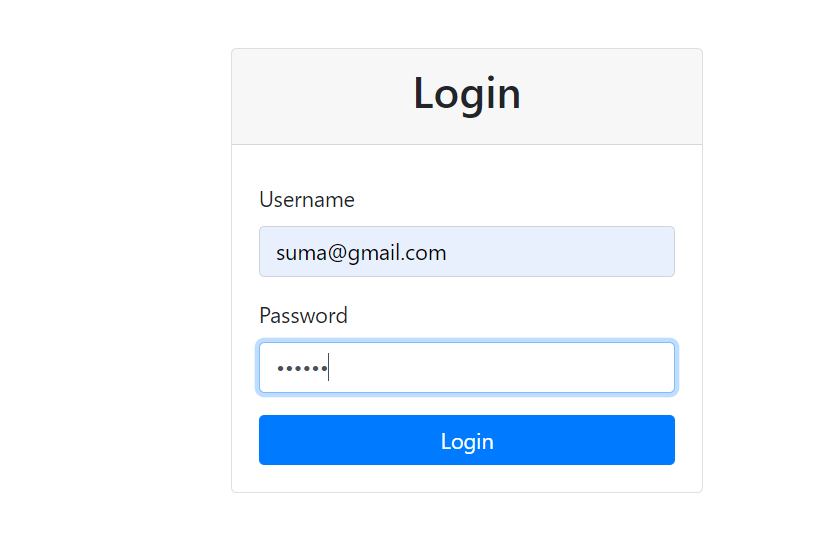
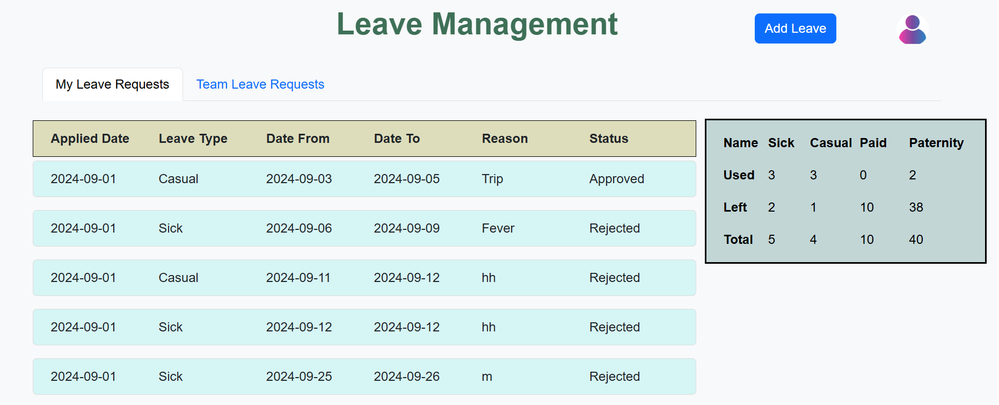
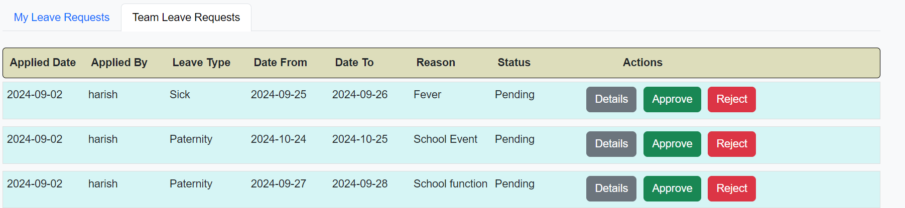
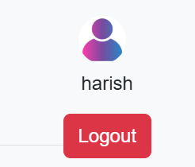
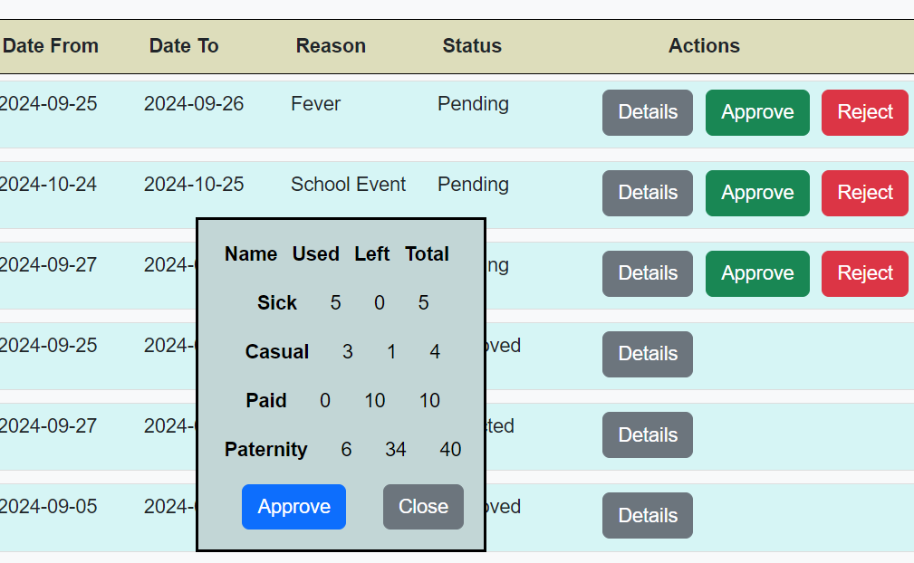
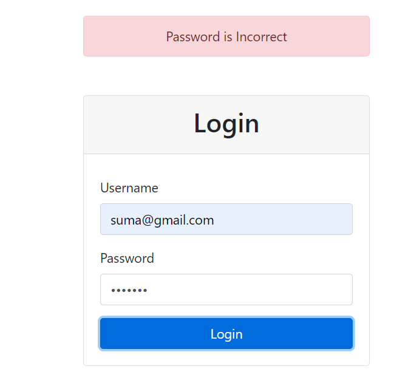
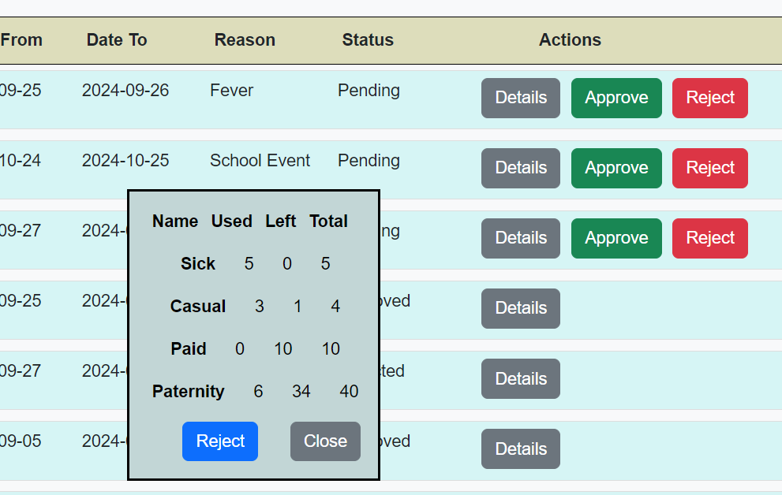
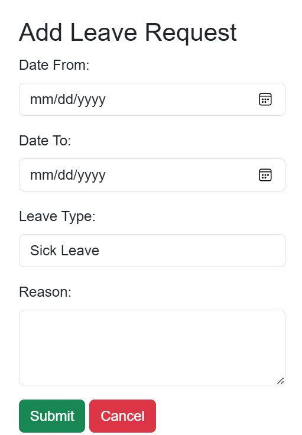
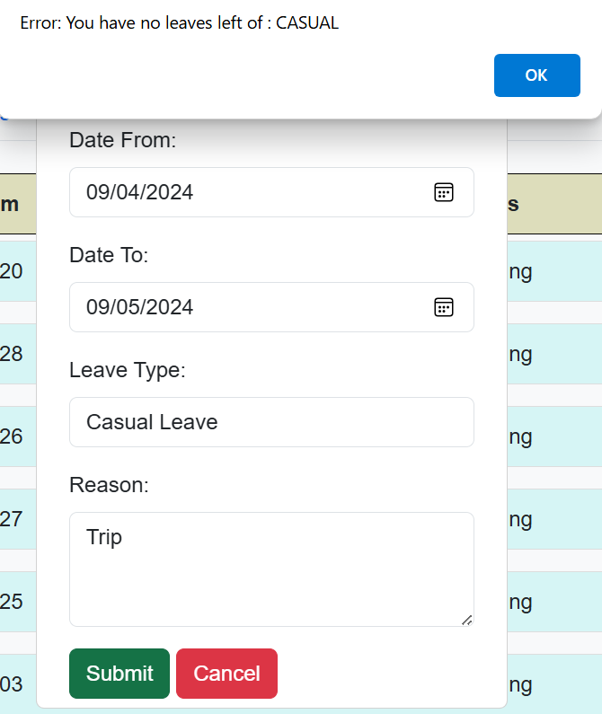
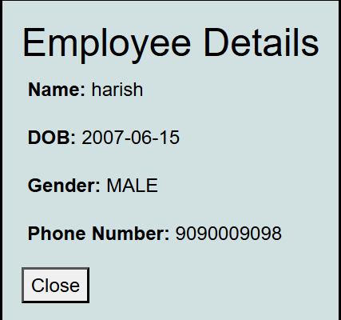

# Leave Management 

## Overview

The Leave Management System is designed to streamline the process of managing employee leave requests. It includes functionalities for users to view their leave status, manage leave requests, and for managers to approve or reject leaves. Some features are still under development. Below is a detailed explanation of each feature with corresponding screenshots where available.

## Features

### 1. Login Page
- **Description**: The login page allows users to authenticate and access the system.
- **Screenshot**: 

### 2. Loading Page
- **Description**: After logging in, users are directed to the dashboard. This page provides an overview of leave requests and other relevant information.
- **Screenshot**: 

### 3. Team Leave Requests
- **Description**: Under the "Teams" tab, clicking "Leave Request" fetches requests that need approval from the manager.
- **Screenshot**: 

### 4. User Profile
- **Description**: Clicking the profile icon displays user information, such as name and logout.
- **Screenshot**: 

### 5. Approving Leave
- **Description**: When clicking the "Approve" button, leave details are displayed.The user can close or approve the leave.
- **Screenshot**: 

### 6. Wrong UserName login
- **Description**: When User Logins with wrong UserName , this message will be displayed.
- **Screenshot**: 

### 7. Wrong Password login
- **Description**:  When User Logins with wrong password , this message will be displayed.
- **Screenshot**: 

### 8. Rejecting Leave
- **Description**:  When clicking the "Rejected" button, user information and leave details are displayed. To confirm the reject, the user must press the confirm button.
- **Screenshot**: 

### 9. Add Leave Req
- **Description**:  When clicking on add leave button, we get this form to add leaves.
- **Screenshot**: 

### 9.Insufficient Leaves
- **Description**:  When clicking on submit button ,if you dont have enough leaves it shows message like this.
- **Screenshot**: 

### 10.Employee Details
- **Description**:  When clicking on Details button in team Leave tab, Manager can see employee details, on close it will close.
- **Screenshot**: 

## Pending Functionalities

The following features are still under development:

- **Date Validation**: Implement date validation to ensure leave requests do not overlap with weekends or holidays.
- **Email Notifications**: Set up email notifications to inform users about the status of their leave requests and updates.
- **Availability Check**: Incorporate an availability check during the leave approval process to ensure leaves can be accommodated.
